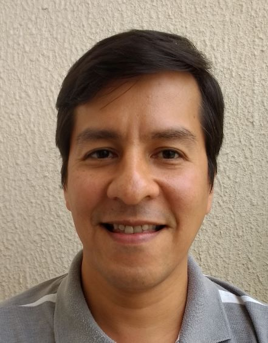

# Um pouco sobre mim
Olá a Todos! Meu nome é Fermin Tang professor universitário na UENF. Este README mostrará algumas poucas informações sobre mim.

## Sobre minha Profissão
Eu sou formado na área de Pesquisa Operacional, uma área interdisciplinar que lida com problemas de otimização, planejamento, decisão e que utiliza métodos computacionais para resolver esse tipo de problemas. A mihha formação me aproximou dos cursos de Engenharia de Produção e da Ciência da Computação. Atuo principalmente na area acadêmica como docente e por isso me interesso também pelas questões pedagógicas.

## Meus Hobbies
Gosto muito de tecnologia, de jogos de computador, de filmes de ficção científica, suspenses e comedias românticas. Gosto de uma vida tranquila e sobretodo de poder sorrir no final do dia!

## Meus Filmes Faboritos
Gosto muito da Trilogia do Senhor dos Aneis, Star Wars, A lista de Schindler, Doutor Jivago, e tantos outros, difícil escolher.
